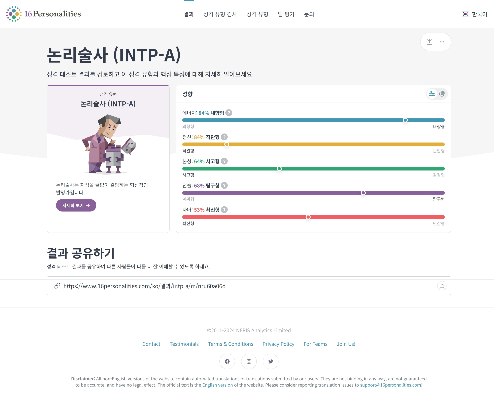
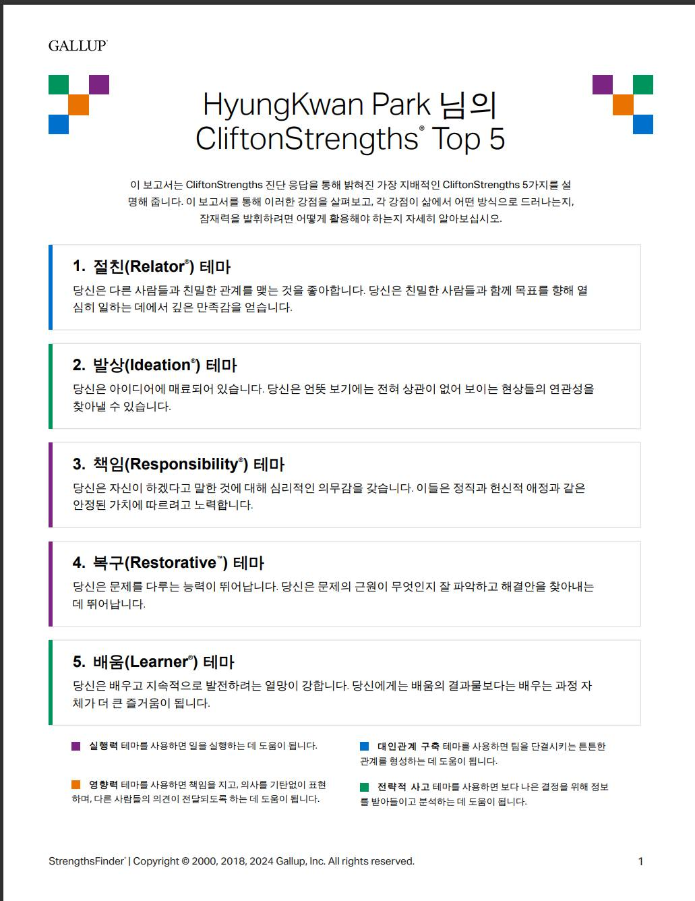
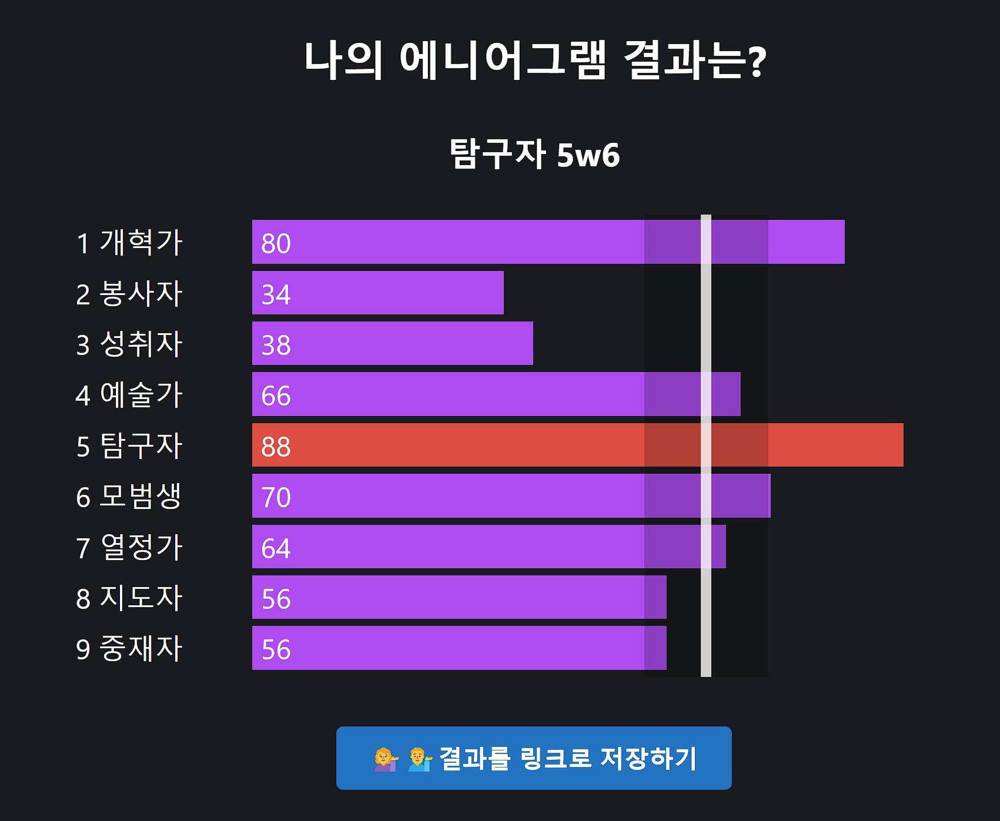
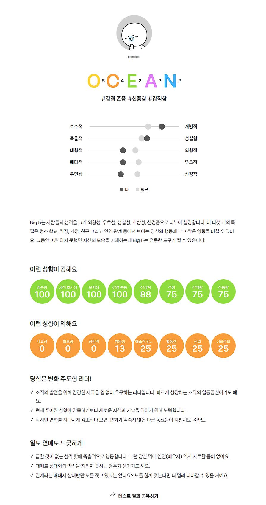

*[한국어](CV_ko.md) | [日本語](CV_jp.md)*

# Hyunggwan Park (박형관)

> A web developer who thinks from the customer's perspective, designs comprehensible architecture, and builds reliable systems.

---

## 📬 Contact & Links

| | |
|------|------|
| Email | violethpark@outlook.com |
| GitHub | [github.com/violethpark](https://github.com/violethpark) |
| Blog | [phk-laboratory.blogspot.com](https://phk-laboratory.blogspot.com/) |
| Facebook | [facebook.com/violethpark](https://www.facebook.com/rpdladps) |

---

## 🛠️ Tech Stack

### Backend

Java · Spring Boot · Spring Framework · MyBatis · JSP · Maven · Apache Tomcat · Apache Web Server · eGovFramework

### Frontend

TypeScript · JavaScript · Vue.js 3 · Vuetify · React · Next.js · HTML5 · CSS3 · Bootstrap · Sass · jQuery

### Database

Oracle DB · MySQL

### Cloud & DevOps

AWS (S3) · Vite · Git · GitLab · Node.js

---

## 💼 Work Experience

### Hypertech — SW Engineering Division · Assistant Manager

**Jun 2024 – Present** | Maintenance Developer

- Lead developer for Korea Arts Welfare Foundation integrated information system maintenance
- Primary owner of 4 systems: Artist Career Information System, Rights Protection System, Industrial Accident Insurance, Artist Pass
- Secure coding, privacy compliance assessment, web vulnerability response
- Production deployment, maintenance, and feature development based on client requirements

### Pentaworks — SCP Lab (HQ R&D) · Researcher

**May 2022 – Nov 2023** (1 year 7 months) | Full-Stack Developer

- Emerging technology research and PoC development
- Internal framework management and enhancement
- Frontend/Backend design, development, and QA
- GitLab administration

---

## 📂 Key Projects

### 1. Korea Arts Welfare Foundation — Information System Maintenance

**Jul 2024 – Present** | Java, Oracle DB, eGovFramework, JSP, jQuery

- Java 1.7 → 1.8 migration
- Implemented i-PIN identity verification and one-account-per-person policy
- Database error correction and terms-of-service consent history management
- National Pension and Industrial Accident Insurance support program development

### 2. In-house Project AER — Vue (Frontend Lead)

**Oct 2022 – Oct 2023** (~1 year) | Spring Boot, Vue.js 3, Vuetify, TypeScript, MySQL, AWS

- MSA/AWS-based backend API design and DB design for membership module (ERD, UML, specifications)
- Lead frontend developer — architecture design and team leadership
- Built frontend from scratch using Vue.js 3, Vuetify, TypeScript, Pinia, Vite
- Collaboration with a 7-member frontend team including external partners
- End-to-end participation: planning QA → design → development → QA integration testing

### 3. In-house Project AER — React (Frontend Lead)

**Oct 2023 – Nov 2023** (~2 months) | React, Next.js, JavaScript

- Vue (TypeScript) → React (JavaScript) migration
- Introduced Next.js framework considering service requirements
- Proposed source structure and development patterns; conducted team training

### 4. In-house Project GDC (PoC)

**Jun 2022 – Aug 2022** (~2 months) | Vue.js 3, TypeScript, Vite, Bootstrap

- Rapid PoC implementation with a 2-person development team
- First adoption of Vue.js 3 and TypeScript within the company
- Refactored Axios-dependent API call code to library-agnostic implementation
- Laid the foundation for the subsequent AER project

### 5. Internal Backoffice Framework Migration

**2022** | Vue.js 2.5 → 2.7, Vite, Node.js 18

- Migrated legacy build tooling (vue-cli, babel, Node.js 12) to modern stack (Vite, Node.js 18)
- Achieved 10x+ improvement in build times

---

## 🎓 Education

**Yonsei University (Seoul)** — B.S. in Computer Science (Mar 2009 – Feb 2016)

---

## 📜 Certification

- **Engineer Information Processing** — Human Resources Development Service of Korea (Jul 2015)

---

## 🪖 Military Service

Republic of Korea Army, Sergeant, Honorable Discharge (May 2013 – Feb 2015)

**IT Specialist — Capital Corps Command (수도군단사령부) IT Center**

- Served as a server management specialist at the Corps IT Center (Chungui Unit)
- Managed and maintained servers across multiple platforms (Windows Server, UNIX, Linux)
- Performed routine maintenance of storage systems and IT infrastructure
- Monitored and managed the military base network operations
- Managed and maintained the unit’s official website
- Provided IT equipment installation support for shared office spaces across departments
- Handled network equipment installation, configuration, and recovery tasks
- Gained foundational experience in system administration, troubleshooting, and infrastructure management

---

## 💡 About Me

I'm Hyunggwan Park, a web developer driven by curiosity and a passion for problem-solving. I find fulfillment in overcoming challenges and joy in continuous learning. Through diverse projects, I've built expertise in both frontend and backend development, and I value teamwork to create better outcomes. I thrive on new challenges and growth, always striving to deliver better services.

---

## 📎 Appendix — Personality Assessments

<!-- Images are located in the images/ folder -->

### MBTI — INTP-A

### CliftonStrengths Top 5

### Enneagram — Investigator 5w6

### Big Five Personality Test — OCEAN

---

<!-- TODO: Add project screenshots, certificate scans, etc. -->
